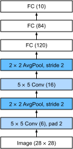
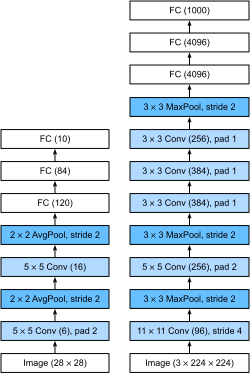
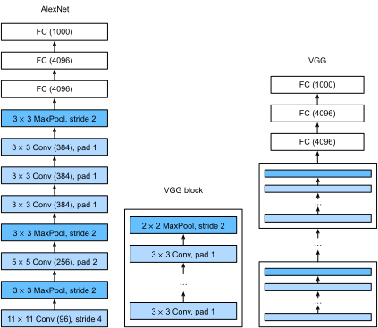
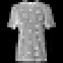
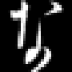
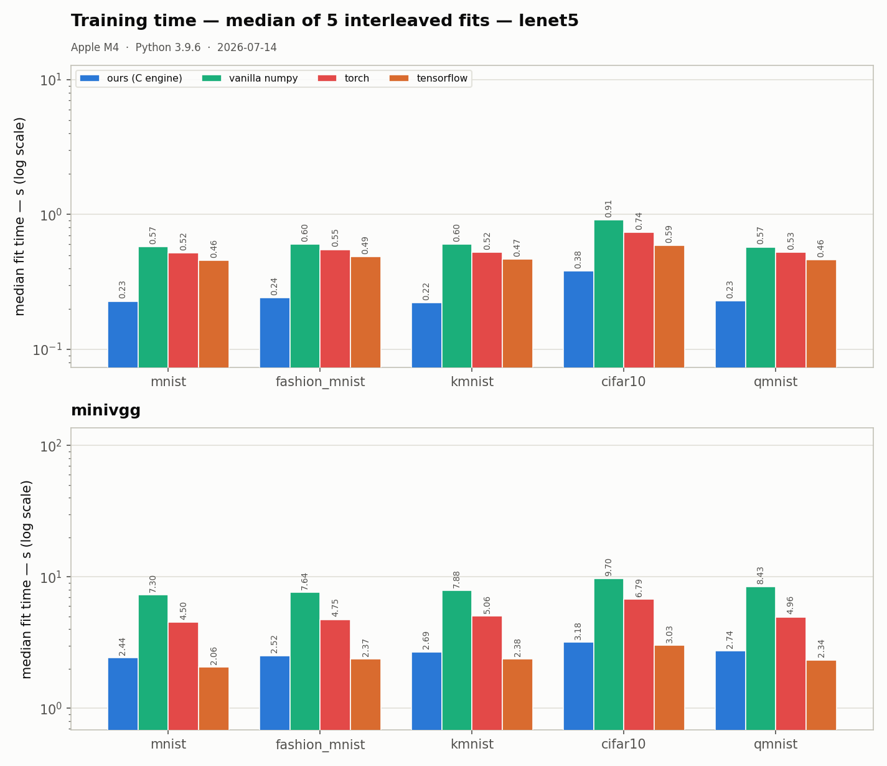
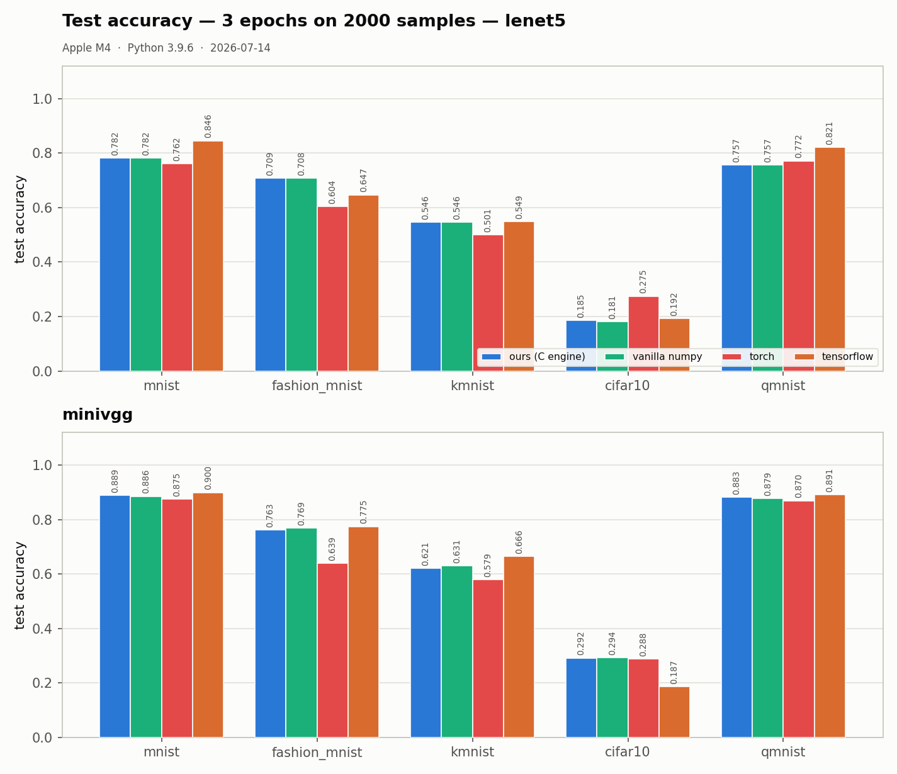
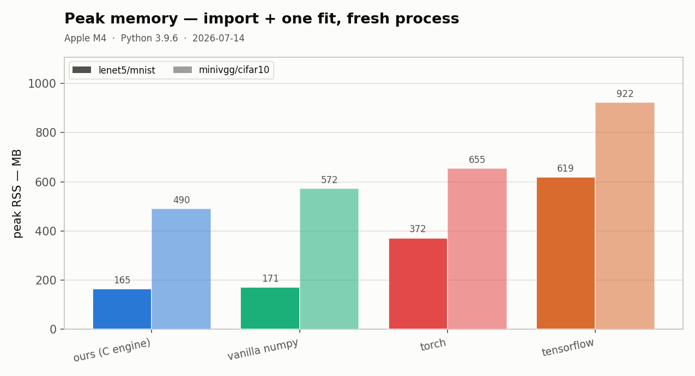

# mantissa-cnn


[](https://github.com/tekinertekin/mantissa)

**Classic CNNs, with a C engine.**

A small convolutional-network classifier (`fit` / `predict` / `score`) whose
compute runs in [mantissa](https://github.com/tekinertekin/mantissa) — a
fast, memory-lean neural-network core in C. The Python layer is thin on
purpose: convolution (im2col + GEMM), pooling, the dense head, the fused
softmax-cross-entropy loss and the SGD update all execute in C on zero-copy
float32 buffers. A pure-numpy backend with the identical call signatures
(`backend="numpy"`) serves as the correctness oracle in the test suite and
as a fallback when the engine is absent.

Deliberately minimal: NCHW float32 images, integer class labels, softmax
cross-entropy, plain SGD. No autograd graph, no optimizer zoo, no data
augmentation. Layers allocate their forward/backward scratch once per batch
shape and reuse it across batches and epochs — steady-state training does no
per-batch allocation.

## Install

```sh
pip install mantissa-cnn   # after PyPI publication
```

Requires the engine `mantissa-nn >= 0.2.1` (the release that adds the CNN
primitives). From a checkout (works today, no PyPI needed): clone this repo
next to [mantissa](https://github.com/tekinertekin/mantissa), build the
engine (`make dist` there), then `pip install -e .` here — the package finds
the sibling checkout automatically.

## Quickstart

```sh
# datasets never download implicitly — fetch explicitly, once:
python -m mantissa_cnn.datasets download mnist     # or: download all
python -m mantissa_cnn.datasets list
```

```python
from mantissa_cnn import models, datasets

X_train, y_train, X_test, y_test = datasets.load("mnist")
net = models.lenet5()                    # C engine; backend="numpy" also works
print(net.summary())
net.fit(X_train, y_train, epochs=3, batch_size=32, lr=0.01, verbose=True)
print(net.score(X_test, y_test))
```

Or compose your own:

```python
from mantissa_cnn import Sequential, Conv2D, MaxPool2D, Flatten, Dense

net = Sequential([
    Conv2D(8, 3, pad=1, act="relu"),
    MaxPool2D(2),
    Flatten(),
    Dense(10),               # identity logits — softmax lives in the loss
], seed=0)
```

## New to CNNs? The three ideas in this package

**Convolutional layer.** Instead of connecting every pixel to every neuron
(a dense layer), a convolutional layer slides a small learned filter — say
5×5 numbers — across the image and, at each position, multiplies and sums
the overlapping values into one output cell. The same filter is reused at
every position, so the layer learns *local* patterns (an edge, a corner, a
stroke) wherever they appear, with a few dozen weights instead of millions
(LeCun, Bottou, Bengio & Haffner, 1998, "Gradient-Based Learning Applied to
Document Recognition", *Proc. IEEE*; the mechanism dates to Fukushima's
neocognitron, 1980). One layer learns many filters; each produces its own
output map ("channel"):


**Padding.** Each pass of a filter shrinks the image (a 5×5 filter turns
28×28 into 24×24) and reads border pixels fewer times than central ones.
Padding fixes both: rows and columns of zeros around the input let the
filter's center reach the true edges, so the output keeps the input's size
(`pad=1` with 3×3 filters — the VGG recipe) and border information
survives deep stacks. The full input/output-size arithmetic is worked out
in Dumoulin & Visin (2016), "A guide to convolution arithmetic for deep
learning", arXiv:1603.07285:


**Max pooling.** Between convolutions, a pooling layer slides a small
window (here 2×2) and keeps only the largest value in it — the image
halves in width and height, the strongest responses survive, and the exact
pixel position of a feature stops mattering (a slightly shifted "7" is
still a "7"). Max beats average pooling for recognition in the systematic
comparison of Scherer, Müller & Behnke (2010, "Evaluation of Pooling
Operations in Convolutional Architectures for Object Recognition",
*ICANN*):


Stack these — convolve, pool, convolve, pool, then a couple of dense
layers — and you have every model in the zoo below.

<sub>Concept diagrams by Zhang, Lipton, Li & Smola, [*Dive into Deep
Learning*](https://d2l.ai), CC BY-SA 4.0, unmodified — the same source and
license as the architecture diagrams below.</sub>

## Model zoo

Honest names: these are the classic architectures at small-image scale, not
the ImageNet originals.

| model | architecture | paper |
|-------|--------------|-------|
| `lenet5` | Conv 6@5x5 → pool → Conv 16@5x5 → pool → 120 → 84 → classes; faithful C1..F6 shapes (relu instead of the paper's tanh — flagged deviation) | LeCun, Bottou, Bengio & Haffner (1998), "Gradient-Based Learning Applied to Document Recognition", *Proc. IEEE* 86(11) |
| `minivgg` | [32, 32, pool] → [64, 64, pool] → 128 → classes, all 3x3 pad-1 — VGG-style blocks at CIFAR scale, **not** VGG-16 | Simonyan & Zisserman (2015), "Very Deep Convolutional Networks for Large-Scale Image Recognition", *ICLR* |
| `alexnet_small` | 64 → pool → 192 → pool → 384 → 256 → 256 → pool → 1024 → 512 → classes, 3x3 kernels — AlexNet-style at CIFAR scale, **not** the ImageNet net | Krizhevsky, Sutskever & Hinton (2012), "ImageNet Classification with Deep Convolutional Neural Networks", *NeurIPS* |

### The originals, for reference

What the papers built (our zoo keeps the layer *pattern* and shrinks the
scale — see the honest-name notes above):

**LeNet-5** (LeCun et al., 1998) — `lenet5` keeps these exact C1..F6 shapes:



**AlexNet** (Krizhevsky et al., 2012) vs LeNet — `alexnet_small` keeps the
conv-conv-conv stack and the big dense head, at 32×32:



**VGG** (Simonyan & Zisserman, 2015) — `minivgg` keeps the same-width 3×3
conv *blocks* with pooling between, two blocks instead of five:



<sub>Diagrams by Zhang, Lipton, Li & Smola, [*Dive into Deep Learning*](https://d2l.ai)
(LeNet-5 and AlexNet via Wikimedia Commons), licensed
[CC BY-SA 4.0](https://creativecommons.org/licenses/by-sa/4.0/) — redistributed
here with attribution, unmodified.</sub>

## Datasets

Five image-classification classics, all 10-class. **Nothing downloads
implicitly** — `data/` is gitignored and library code never touches the
network; missing files raise with the exact fix command.

| name | train/test | shape | source |
|------|------------|-------|--------|
| mnist | 60k / 10k | 1×28×28 | LeCun et al. (1998) |
| fashion_mnist | 60k / 10k | 1×28×28 | Xiao, Rasul & Vollgraf (2017) |
| kmnist | 60k / 10k | 1×28×28 | Clanuwat et al. (2018) |
| qmnist | 60k / 60k | 1×28×28 | Yadav & Bottou (2019) |
| cifar10 | 50k / 10k | 3×32×32 | Krizhevsky (2009) |

One test sample from each, with a LeNet-5's output under it (3-epoch
protocol budget; correctly-classified examples — the *measured* accuracy
per dataset is in [Results](#results)):

| mnist | fashion_mnist | kmnist | cifar10 | qmnist |
|:-----:|:-------------:|:------:|:-------:|:------:|
|  |  |  |  |  |
| → “4” | → “t-shirt” | → “na” (な) | → “airplane” | → “2” |

`datasets.load(name)` → `(X_train, y_train, X_test, y_test)`, NCHW float32
in [0, 1], int32 labels. `datasets.subset(name, n_train, n_test, seed)`
gives seeded stratified subsets (the benchmark protocol uses 2000/1000).

## Results

<!-- BEGIN:BENCH (bench/speed.py + bench/accuracy.py + bench/plots.py output; do not edit outside these markers) -->
Protocol: the **same architecture, re-expressed layer-for-layer in each
framework** (`torch.nn.Sequential`, `tf.keras.Sequential`, our `Sequential`),
identical hyperparameters everywhere — plain SGD, lr 0.01, batch 32, 3
epochs, seed 0 — on stratified 2000-train / 1000-test subsets, CPU only.
Fit wall-time is the median of 5 interleaved repeats; peak RSS is one fresh
subprocess per (contender, pair), import cost included. `vanilla numpy` is
this package's pure-numpy reference backend — no mantissa engine — showing
what the C core buys. scikit-learn is deliberately absent: it offers no
convolutional layers, so it cannot run these architectures.

**LeNet-5 on MNIST** (28×28 grayscale — the architecture's home ground):

| contender | fit (s) ↓ | predict (ms) ↓ | peak RSS (MB) ↓ | test acc |
|-----------|----------:|---------------:|----------------:|---------:|
| **ours (mantissa)** | **0.228** | **8.1** | **165** | 0.782 |
| tensorflow | 0.458 | 42.1 | 619 | 0.846 |
| torch | 0.519 | 13.4 | 372 | 0.762 |
| vanilla numpy | 0.575 | 40.0 | 171 | 0.782 |

**Mini-VGG on CIFAR-10** (32×32 RGB — the heavy, 3×3-block workload):

| contender | fit (s) ↓ | predict (ms) ↓ | peak RSS (MB) ↓ | test acc |
|-----------|----------:|---------------:|----------------:|---------:|
| tensorflow | **3.027** | **165.6** | 922 | 0.187 |
| **ours (mantissa)** | 3.182 | 175.2 | **490** | 0.292 |
| torch | 6.789 | 256.6 | 655 | 0.288 |
| vanilla numpy | 9.696 | 608.5 | 572 | 0.294 |





**The honest read.**
- **LeNet-scale nets are ours across the board**: on all five datasets the
  C engine fits ~1.5–2.4× faster than torch *and* tensorflow (torch
  1.9–2.4×, tensorflow 1.5–2.1× behind), runs the fastest batch predict,
  and holds the lowest peak RSS (2.3–3.8× under the frameworks on MNIST).
  At this scale the frameworks pay per-op dispatch and graph overhead that
  a thin C core simply doesn't have.
- **The heavy VGG blocks are a photo finish**: the first run of this
  table had TensorFlow's compiled graph 1.3× ahead on minivgg fit and
  1.6× on predict. That gap was recorded as the engine's next target, and
  mantissa v0.2.2 (batch-whole panel-packed GEMM + a NEON 6×16
  micro-kernel, 148 → 363 GFLOP/s on the VGG-block shape) closed it to
  single digits. Re-measured under v0.2.3, TensorFlow leads by **5% on
  fit and 6% on predict** on CIFAR-10 (5–18% on fit across the five VGG
  pairs — gaps this small move between runs about as much as between
  releases) — while ours uses 47% less peak memory than TensorFlow.
  torch's eager mode trails ours 2.1× here. The remainder is Winograd
  territory, and it is recorded as such.
- **Accuracy lands in the same band for everyone** on each pair — same
  structure, same budget, different init/shuffle streams (seeded per
  framework; they cannot be made bit-identical across libraries). Nobody
  tuned anything. CIFAR-10 at 2000 samples × 3 epochs is hard for every
  contender (0.19–0.30) — that row measures speed under a fixed budget,
  not achievable CIFAR accuracy.
- **The benchmark improved the package**: the first RSS pass was dominated
  by dataset loading in *every* contender — `load()` converted the full set
  to float32 before `subset()` sliced it. Loading now stays uint8 until
  after the slice (bit-identical subsets, measured 672 → 195 MB on the
  qmnist worker). Measure, don't assume.

**Fairness caveats.** TF's one-time graph tracing is excluded from fit
timing (as imports are for everyone); torch runs eager, its default mode.
CPU only — no MPS/Metal on any contender. Thread settings left at each
framework's defaults and recorded in the JSON. All raw samples live in
`bench/results/` (regenerable, gitignored).

**Environment.** Apple M4 · Python 3.9.6 · numpy 2.0.2 · torch 2.8.0 ·
tensorflow 2.20.0 · mantissa 0.2.3 (f32 CNN primitives, audit release) ·
2026-07-14.
Reproduce: `python -m bench.speed && python -m bench.accuracy && python -m
bench.plots`.
<!-- END:BENCH -->

### Methodology

Fixed protocol for every contender: identical architectures, subsets,
epochs, batch size, learning rate and seeds. Timings are medians over
interleaved repeats on one machine (library versions and CPU recorded in the
results JSON); peak RSS is measured per contender in a fresh subprocess,
import cost included, because that is what a user pays. scikit-learn cannot
express a CNN, so its MLP entry is labeled a non-CNN baseline, not a rival.
*Measure, don't assume.*

## License

MIT — © Tekin Ertekin. Engine:
[mantissa](https://github.com/tekinertekin/mantissa), same author, MIT.
